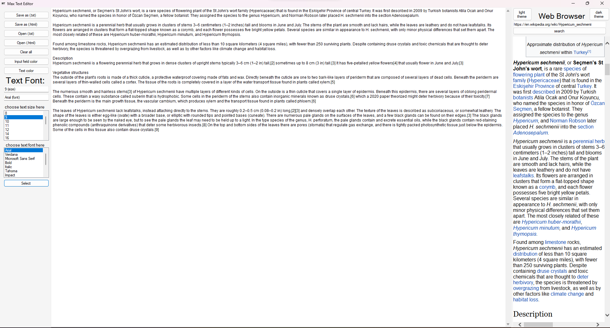

# Windows-Forms-Text-Editor

A multifunctional text editor in c#. It has functions for saving and opening txt and html files, setting the color of the text and background, switching from a light to a dark theme, setting the size and font of the text. There is also an Internet browser for viewing information.

